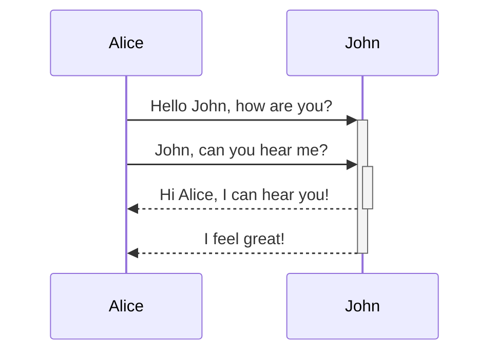
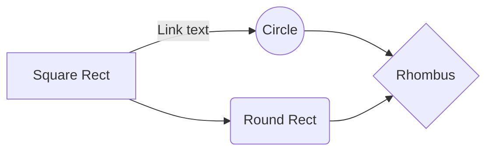

#✅ 
Примеры редактирования текста

`==Text==`		==Text==

`**Text**`		**Text**

`*Text*`		*Text*

`~~this~~`  ~~this~~

`[[обучение]]`		[[обучение]]

`[[Коллеткивное Правление|коллекивного правления]] ` [[Коллективное Правление 2021-09-06|коллекивного правления]] 

` ```текст ``` `	```текст```

`%%text`		%%text

`#text`		#text 		-хэштег
<big>3123

[сайт](https://threejs.org/)

![[Inbox/Study/psychology/9-ять стилей обучения/1. Чувствующий/Как освоить чувствующий стиль#Ключевые вопросы]]

![[George Orwell.jpg|200x300]]

![[Nineteen Eighty-Four (1984)#^e8b9b5]]]

1. Categories of things
   1. A subcategory
   1. Another subcategory
      1. An example of an item
      1. A different, equally important item.


Function                        |   | Shortcut          
------------------------------- | - | ------------------
Editor: save file               |   | `Ctrl/Cmd+S`      
Create new note                 |   | `Ctrl/Cmd+N`      
Open command palette            |   | `Ctrl/Cmd+P`      
Open quick switcher             |   | `Ctrl/Cmd+O`      
Search in all files             |   | `Ctrl/Cmd+Shift+F`
Open graph view                 |   | `Ctrl/Cmd+G`      
Star current file               |   | Blank             
Unstar current file             |   | Blank     

![[Философия]]

> Human beings face ever more complex and urgent problems, and their effectiveness in dealing with these problems is a matter that is critical to the stability and continued progress of society.

\- Doug Engelbart, 1961

[Import from Notion](https://forum.obsidian.md/t/import-from-notion/636)


<iframe src="https://www.youtube.com/embed/NnTvZWp5Q7o"></iframe>


<iframe
    border=0
    frameborder=0
    height=250
    width=550  
    src="https://twitframe.com/show?url=https%3A%2F%2Ftwitter.com%2Fjack%2Fstatus%2F20">
</iframe>






Правила заполнения:
- Краткий пересказ
- Что больше всего впечатлило
- Суть
---


Here is some inline comments: %%You can't see this text%% (can't see it in preview)

Here is a block comment: (can't see it in preview either)
%%
It can span
multiple lines
%%

```md
Here's a simple footnote,[^1] and here's a longer one.[^bignote]

[^1]: meaningful!

[^bignote]: Here's one with multiple paragraphs and code.

    Indent paragraphs to include them in the footnote.

    `{ my code }`

    Add as many paragraphs as you like.
```

[[обучение]]

